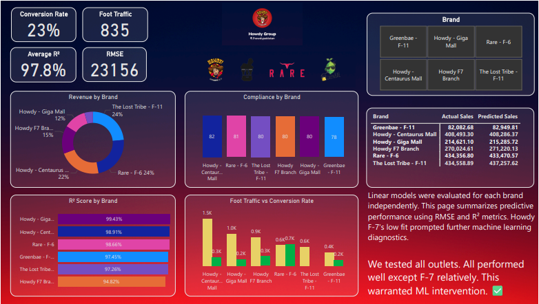

  

Howdy Intelligent Sales System

🔍 Overview

This project was developed by the Business Analytics & Compliance Executive at Howdy Group to create a data-driven sales prediction and simulation framework across multiple restaurant brands. The system uses machine learning and simulation to improve forecasting accuracy, diagnose underperformance, and provide strategic recommendations using real-world business levers like staff, promotions, compliance, and weather.

🧠 What We Built

1. Python Intelligence Engine

Trained segmented linear regression models for each outlet (e.g., Howdy F7, Giga Mall, The Lost Tribe, etc.)

Identified underperforming outlets (Howdy F7 had R² ~94.8%)

Applied Random Forest Regression to Howdy F7 for better non-linear prediction (R² ~99.28%)

Used SHAP for model interpretability

Created a simulation engine that ran 4,000+ business cases across different foot traffic, rain, staffing, and promotion combinations

Labeled each scenario with a risk flag and generated an actionable recommendation

2. Power BI Dashboard

Built an interactive 2-page report:

Page 1: Segmented model summary (R² by brand, compliance, conversion rate, foot traffic vs sales)

Page 2: Diagnostic deep-dive for Howdy F7 with SHAP, simulation sliders, prediction logic, and recommendation engine

Included slicers for promotion type, weather condition, foot traffic, and simulation scenario conditions

Added a simulation log table for 4,000+ predictions

📁 Files in This Repo

howdy_intelligence_system.ipynb

Howdy_Analytics_Dashboard.pbix

Howdy_DF.xlsx

AllOutletsModel.csv

Howdy Project Summary.pdf

✅ Business Impact

Flagged inefficient outlet behavior under combo promo and overstaffing

Surfaced Rs 114K revenue opportunity in simulated conditions using targeted promo and staffing combinations

Enabled strategic decisions on promo switching, staff adjustments, and weather-based planning

Built a repeatable system for forecasting and scenario testing by brand

Delivered real-time analytics through an interactive Power BI dashboard

👨‍💼 Author

Developed during my tenure as Business Analytics & Compliance Executive at Howdy Group, as part of ongoing efforts to enhance operational intelligence, predictive planning, and outlet-level decision support.

🏁 How to Use

Open howdy_intelligence_system.ipynb to inspect model logic

Explore Howdy_Analytics_Dashboard.pbix to interact with predictions
